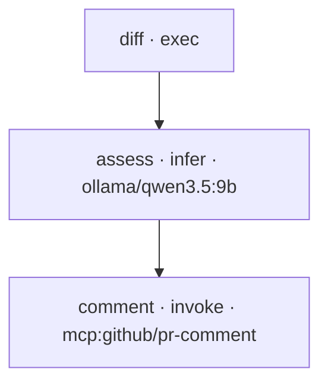

<h1 align="center">nika-actions-starter</h1>

<p align="center"><strong>AI-workflow receipts in your CI.</strong><br>
Every pull request gets a static verdict, posted as a sticky comment: what each
workflow would do, an honest cost floor, which secrets it wants, the DAG.
Checked before a single token is spent. Nothing is executed.</p>

<p align="center">
  
</p>

## See it live

The CI in this repo runs on its own pull requests. **Open [Pull requests](../../pulls)
and read the sticky "nika check" comment** on any of them: that is exactly what
you get in your own repo, day one, including the DAG rendered inline.

## The DAG, drawn by nika itself

Every diagram below is generated by `nika graph`, not drawn by hand. Run it on
any workflow and paste the output; it renders on GitHub as-is.

`flows/pr-risk-review.nika.yaml`:



The `comment` node only fires `when` the risk comes back high. In CI this file
is **checked, not run**, so the sticky comment shows this shape and its honest
cost floor before anything happens.

## Use it

1. Click **Use this template** (top right).
2. That is it. On your first push and every PR after, the check runs and the
   verdict lands as a comment. No API key, no model server, no secrets: the
   check is fully static.

Already have a repo? Add the check in **one line** with the reusable workflow:

```yaml
jobs:
  nika:
    permissions:
      contents: read
      pull-requests: write
    uses: supernovae-st/nika-actions-starter/.github/workflows/nika-check.yml@main
    with:
      workflow: path/to/your.nika.yaml
```

Prove it locally too (single binary):

```bash
brew install supernovae-st/tap/nika
nika check flows/pr-risk-review.nika.yaml
nika graph flows/pr-risk-review.nika.yaml   # the diagram above, from your terminal
```

## What is inside

| File | What it does |
|---|---|
| `flows/pr-risk-review.nika.yaml` | the signature flow: read a PR diff, judge its risk, comment only when it is high. Declares its tightest permits (`exec: ["git"]` and one MCP tool, everything else default-deny) |
| `flows/daily-brief.nika.yaml` | a simple offline-provable flow: fetch a feed, brief it with a local model, save |
| `.github/workflows/nika.yml` | the CI that posts the sticky verdict on every flow, fork-safe by design |
| `.github/workflows/nika-check.yml` | the reusable workflow for one-line adoption in other repos |
| `AGENTS.md`, `.agents/`, `.vscode/` | written by `nika init`: teaches your coding agent and your editor about `.nika.yaml` files |

## Why a verdict in your CI

The interesting failures in AI work happen before the model is even called: a
workflow that spends more than you think, a secret that flows into the wrong
step, a plan that does not do what the file says. `nika check` catches those
statically. Putting it in CI means the receipt shows up where your team already
looks: on the PR.

The action does check-only and zero-secret by default. It never grants
`pull_request_target`. On fork PRs the token is read-only, so the verdict lands
in the step summary instead of a comment. Execution is not this action's job.

## Add the badge

```md
[](https://github.com/YOUR_ORG/YOUR_REPO/actions/workflows/nika.yml)
```

<p align="center">
  <sub>Docs: <a href="https://docs.nika.sh">docs.nika.sh</a> · The action: <a href="https://github.com/supernovae-st/nika-action">nika-action</a> · Engine (AGPL-3.0): <a href="https://github.com/supernovae-st/nika">nika</a></sub>
</p>
