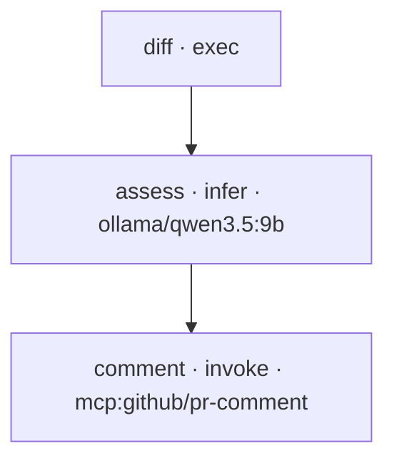
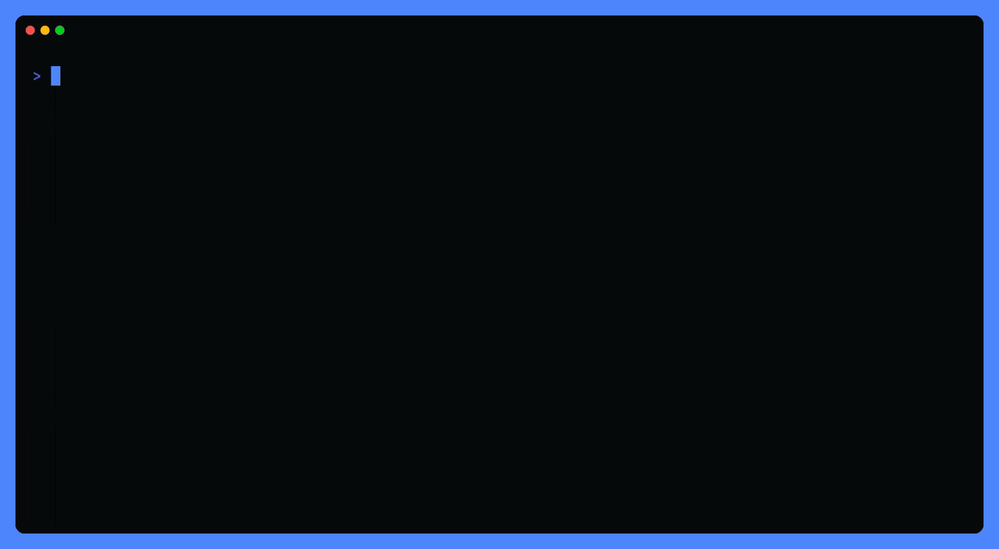

<h1 align="center">nika-actions-starter</h1>

<p align="center"><strong>Repeatable AI jobs as files, with receipts.</strong><br>
The one template: proven workflows, editor and agent wiring, and CI that gives
every pull request a static verdict as a sticky comment. What each workflow
would do, an honest cost floor, which secrets it wants, the DAG. Checked before
a single token is spent. Works the same on your machine and on a runner.</p>

<p align="center">
  
</p>

## See it live

The CI in this repo runs on its own pull requests. **Open [Pull requests](../../pulls)
and read the sticky "nika check" comment** on any of them: that is exactly what
you get in your own repo, day one, including the DAG rendered inline.

## The DAG, drawn by nika itself

Every diagram below is generated by `nika inspect`, not drawn by hand. Run it on
any workflow and paste the output; it renders on GitHub as-is.

`flows/pr-risk-review.nika.yaml`:


```mermaid
graph TD
  diff["diff · exec"]
  assess["assess · infer · ollama/qwen3.5:9b"]
  comment["comment · invoke · mcp:github/pr-comment"]
  assess --> comment
  diff --> assess
```

The `comment` node only fires `when` the risk comes back high. In CI this file
is **checked, not run**, so the sticky comment shows this shape and its honest
cost floor before anything happens.

And live from your terminal (`nika check`, then `nika inspect`):

<p align="center">
  
</p>

## Use it

1. Click **Use this template** (top right).
2. That is it. On your first push and every PR after, the check runs and the
   verdict lands as a comment. No API key, no model server, no secrets: the
   check is fully static.

Already have a repo? Add the check in **one line** with the reusable workflow:

```yaml
jobs:
  nika:
    permissions:
      contents: read
      pull-requests: write
    uses: supernovae-st/nika-actions-starter/.github/workflows/nika-check.yml@main
    with:
      workflow: path/to/your.nika.yaml
```

## Run it on your machine too

The same repo is the local starting point. Nothing here is CI-only.

```bash
brew install supernovae-st/tap/nika          # single binary, no runtime

nika check flows/daily-brief.nika.yaml       # the audit before the run
nika run   flows/daily-brief.nika.yaml --model mock/echo   # offline, zero keys
nika inspect flows/pr-risk-review.nika.yaml  # the diagram above, in your terminal
```

Got [Ollama](https://ollama.com)? Drop the `--model` flag and the same file runs
against a real local model:

```bash
nika run flows/daily-brief.nika.yaml
```

You get `brief.md` (the top Hacker News stories, briefed locally) and a
hash-chained trace in `.nika/traces/`. The receipt is checkable:

```bash
nika trace verify    # exits 0, or names the first broken link
```

<p align="center">
  
</p>

<p align="center"><em>check catches it · the fix is named · the run is live · the trace is the receipt</em></p>

## What is inside

| File | What it does |
|---|---|
| `flows/pr-risk-review.nika.yaml` | the signature flow: read a PR diff, judge its risk, comment only when it is high. Declares its tightest permits (`exec: ["git"]` and one MCP tool, everything else default-deny) |
| `flows/daily-brief.nika.yaml` | a simple offline-provable flow: fetch a feed, brief it with a local model, save |
| `.github/workflows/nika.yml` | the CI that posts the sticky verdict on every flow, fork-safe by design |
| `.github/workflows/nika-check.yml` | the reusable workflow for one-line adoption in other repos |
| `AGENTS.md`, `.agents/`, `.vscode/` | written by `nika init`: teaches your coding agent and your editor about `.nika.yaml` files |

## Why a verdict in your CI

The interesting failures in AI work happen before the model is even called: a
workflow that spends more than you think, a secret that flows into the wrong
step, a plan that does not do what the file says. `nika check` catches those
statically. Putting it in CI means the receipt shows up where your team already
looks: on the PR.

The action does check-only and zero-secret by default. It never grants
`pull_request_target`. On fork PRs the token is read-only, so the verdict lands
in the step summary instead of a comment. Execution is not this action's job.

## Add the badge

```md
[](https://github.com/YOUR_ORG/YOUR_REPO/actions/workflows/nika.yml)
```

<p align="center">
  <sub>⭐ If this saved you time, a star helps other people find it.</sub>
</p>

<p align="center">
  <sub>Docs: <a href="https://docs.nika.sh">docs.nika.sh</a> · The action: <a href="https://github.com/supernovae-st/nika-action">nika-action</a> · Engine (AGPL-3.0): <a href="https://github.com/supernovae-st/nika">nika</a></sub>
</p>

---

Nika is independent open source · if this template earns its keep, a ⭐ on
[the engine](https://github.com/supernovae-st/nika) is how the next person finds it.

<!-- city:map -->
## The city · where this repo sits

```
📜 nika-spec ──── the civil code · the law tables, the corpus, the exam
    │ sync-pack: byte-gated mirror        │ projectors: drift-gated
    ▼                                     ▼
⚙️ nika ───────── the engine + the catalog (the yellow pages)
    │ the release train                  🖥️ nika.sh · 📖 nika-docs
    ▼                                     the showroom · the manual
📦 homebrew-tap · npm · Docker ── the docks
🔌 nika-client · 🎨 nika-vscode · 🤖 nika-agents · ⚡ gh-nika ── the doors
🏭 nika-action · 🧪 nika-actions-starter ── the CI district   ◀── you are here
🏪 nika-registry ── the market · 🏛 nika-estate ── the land registry
```

**This building** · THE TEMPLATE · a repository that already works: proven workflows, editor wiring, and CI receipts from the first push.

**Root** · neither · every file here is a copy meant to be edited by whoever clones it. It teaches the LANGUAGE by example and defers to the spec for the law · nothing authoritative is typed here.

**Consumes** · the engine (via brew locally, via the Action in CI) · the spec's grammar · the agent wiring from nika-agents.

**Serves** · anyone starting from zero, on their machine or on a runner.

**Truth lives** · the workflows in `flows/` are checked by the same command your repository will run · if this template drifts from the released grammar, its own CI goes red before yours does.

All the buildings: [nika-spec](https://github.com/supernovae-st/nika-spec) · [nika](https://github.com/supernovae-st/nika) · [nika.sh](https://github.com/supernovae-st/nika.sh) · [nika-docs](https://github.com/supernovae-st/nika-docs) · [nika-client](https://github.com/supernovae-st/nika-client) · [nika-vscode](https://github.com/supernovae-st/nika-vscode) · [nika-agents](https://github.com/supernovae-st/nika-agents) · [gh-nika](https://github.com/supernovae-st/gh-nika) · [homebrew-tap](https://github.com/supernovae-st/homebrew-tap) · [nika-action](https://github.com/supernovae-st/nika-action) · [nika-actions-starter](https://github.com/supernovae-st/nika-actions-starter) · [nika-registry](https://github.com/supernovae-st/nika-registry) · [nika-estate](https://github.com/supernovae-st/nika-estate)

Every fact has one home · everything else is a gated projection.
The living map: [nika.sh/map](https://nika.sh/map).
<!-- /city:map -->
