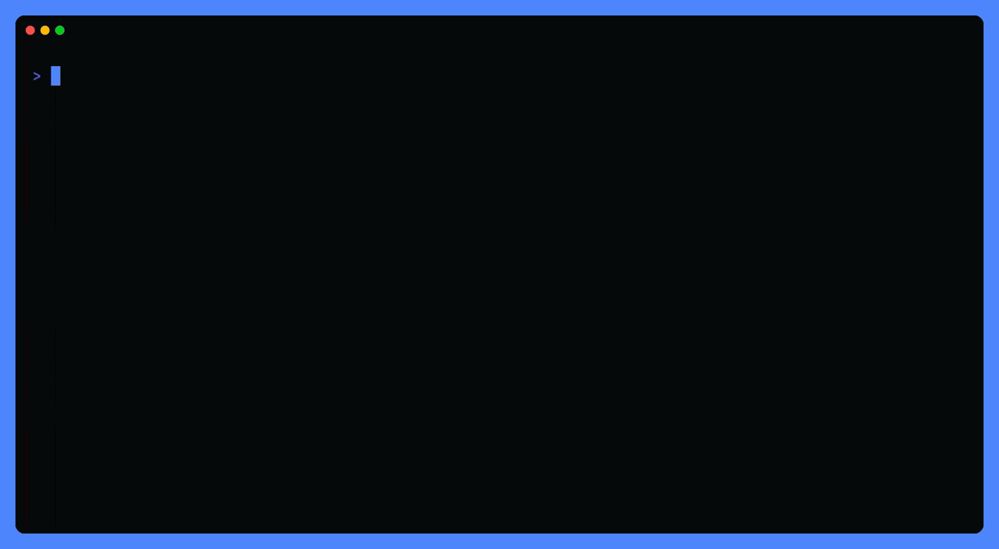

<p align="center">
  <a href="https://nika.sh">
    <picture>
      <source media="(prefers-color-scheme: dark)" srcset="https://nika.sh/brand/nika-logo-dark.svg">
      
    </picture>
  </a>
</p>

<h1 align="center">nika-actions-starter</h1>

<p align="center">
  <strong>Start here: AI workflows as files, with a verdict on every pull request before a token is spent.</strong><br>
  Two working workflows, editor and agent setup, and CI that checks them from the first push. No API key, no model server.
</p>

<p align="center">
  <a href="https://github.com/supernovae-st/nika-actions-starter/generate"></a>
  <br>
  <a href="https://github.com/supernovae-st/nika-actions-starter/actions/workflows/nika.yml"></a>
  <a href="https://github.com/supernovae-st/nika-action/releases/latest"></a>
  <a href="https://github.com/supernovae-st/nika/releases/latest"></a>
  <a href="https://docs.nika.sh"></a>
  <a href="LICENSE"></a>
</p>

<!-- engine clips: served from the engine repository's main branch (media/), so they follow its latest render, not a release tag · each clip's plate names the engine version its output was captured from -->
<p align="center">
  <a href="https://github.com/supernovae-st/nika/raw/refs/heads/main/media/videos/static-check-fix.mp4">
    
  </a>
</p>
<p align="center"><sub><code>nika check</code> in a terminal: the audit your pull requests get as a comment. Click to open the video.</sub></p>

## What is Nika?

Nika turns repeatable AI work into a small file you keep. Say what you
want done, like *"every Monday, pull the action items out of my meeting
notes"*, and Nika writes it as a readable `.nika` workflow. Before
anything runs, `nika check` shows what the workflow will do, which models
and tools it uses, what it is allowed to touch and what it can cost,
without calling a model. You run it when you decide, with the model you
choose, local or cloud, and every run leaves a tamper-evident record you
can verify. One Rust binary, local-first, open source (AGPL-3.0).

| 1 · Say it | 2 · Check it | 3 · Run it | 4 · Prove it |
|:---:|:---:|:---:|:---:|
| Describe the job; Nika writes a `.nika` file | `nika check` audits it before any model is called | `nika run` with the model you choose | `nika trace verify` checks the run's record |

> [!TIP]
> **This template starts you after step 1.** Two `.nika` workflows are already
> written, and CI runs step 2 on every pull request through
> [nika-action](https://github.com/supernovae-st/nika-action). Steps 3 and 4
> run on your machine, with the same files.

<p align="center">
  <a href="#your-first-checked-workflow-in-3-steps">Get started</a> ·
  <a href="#what-ci-does-on-your-pull-requests">What CI does</a> ·
  <a href="#whats-inside">What's inside</a> ·
  <a href="#where-to-edit">Where to edit</a> ·
  <a href="#run-it-on-your-machine">Run it locally</a>
</p>

## Your first checked workflow in 3 steps

1. **Get your copy.** Click <kbd>Use this template</kbd>, then
   <kbd>Create a new repository</kbd>. The check runs on its very first push.
2. **Make a change the check should catch.** On a new branch, set `feed_url`
   in [`flows/daily-brief.nika`](flows/daily-brief.nika) to an RSS feed on
   another site, and open a pull request. The job fails and its comment shows
   ❌: the new host is outside the workflow's `permits:`, the list of what it
   may reach.
3. **Fix it and watch the verdict flip.** Add that host to `permits.net.http`
   in the same file, push, and the same comment turns ✅.

That is the whole loop: every change to a workflow gets a verdict before it
runs anywhere. To check a workflow of your own, add its `.nika` file and list
it under `matrix.flow` in [`.github/workflows/nika.yml`](.github/workflows/nika.yml).

> [!NOTE]
> No API key, no model server, no secrets: the check only reads your files.
> On pushes to `main` the same report goes to the run's summary page, since
> there is no pull request to comment on.

### Already have a repository?

Add the check with one reusable workflow, no copy needed:

```yaml
jobs:
  nika:
    permissions:
      contents: read
      pull-requests: write
    uses: supernovae-st/nika-actions-starter/.github/workflows/nika-check.yml@main
    with:
      workflow: path/to/your.nika
```

## What CI does on your pull requests

For each workflow listed in `.github/workflows/nika.yml`, the job:

1. installs the Nika engine and verifies the download against its release checksums;
2. runs `nika check` on the file: nothing executes, no model is called, no key is read;
3. comments the verdict, a cost floor, the models and secrets the workflow
   would need, and its graph, then edits that same comment on every push;
4. fails when there are findings, so you can make it a required check.

Here is the comment `flows/pr-risk-review.nika` gets, produced by running
the action's own scripts against the released engine 0.121.0. Real ones, from
an older engine, are on
[pull request #14](https://github.com/supernovae-st/nika-actions-starter/pull/14).

> ✅ **nika check** — clean · `flows/pr-risk-review.nika` · 3 task(s) · 3 wave(s)
>
> 💰 **cost floor ≥ $0.00** · ⚠ 1 unpriced/unbounded task(s) — never rendered as $0
> - `assess` · ollama/qwen3.5:9b · unpriced (NoPrice)
>
> 🔐 **requires** — models: `ollama/qwen3.5:9b` · all resolve in this engine · secrets: none
>
> 🌊 **schedule** — 3 wave(s), max width 1
>
> <details><summary>🗺 DAG</summary>
>
> ```mermaid
> graph TD
>   diff["diff · exec"]:::exec
>   assess["assess · infer · ollama/qwen3.5:9b"]:::infer
>   comment["comment · exec"]:::exec
>   assess --> comment
>   assess --> comment
>   diff --> assess
>   classDef infer fill:#5b8cff22,stroke:#5b8cff,color:#5b8cff
>   classDef exec fill:#ff7a3c22,stroke:#ff7a3c,color:#ff7a3c
> ```
>
> </details>
> ---
> <sub>nika 0.121.0 · report_version 1 · floor semantics: spend ≥ floor · [what this checks](https://docs.nika.sh/reference/machine-surfaces)</sub>
> <!-- nika-action:v1:flows/pr-risk-review.nika -->

Read it top to bottom: the file is clean; its one model step runs on a local
model, which has no price, so the cost is shown as unknown rather than free;
it needs no secret; its three steps run one after another. In CI the workflow
is only checked. A real run reads the diff with `git`, asks the model to rate
the risk, and comments with `gh` only when the rating is high; the model's
text reaches `gh pr comment --body` as one argument, never through a shell.

<!-- motion: a pull request receiving the nika check sticky comment -->

> [!WARNING]
> Pull requests from forks get a read-only token, so their report stays on the
> run's summary page instead of becoming a comment. That is on purpose: never
> switch to `pull_request_target` to force it.

## What's inside

<table>
  <tr>
    <td width="33%" valign="top"><b>Two working workflows</b><br>A pull-request risk review that comments only when the risk is high, and a morning brief of the Hacker News front page written by a local model.</td>
    <td width="33%" valign="top"><b>Editor and agent setup</b><br>Editor settings map <code>*.nika</code> to the workflow schema, and agent guides teach Claude Code, Codex, Cursor and Copilot the language.</td>
    <td width="33%" valign="top"><b>CI from the first push</b><br>Pushes to <code>main</code> and every pull request are checked, and pull requests get the comment.</td>
  </tr>
  <tr>
    <td valign="top"><b>A boundary in every file</b><br>Each workflow lists what it may reach in <code>permits:</code>, and anything else is refused.</td>
    <td valign="top"><b>Costs before tokens</b><br>The check shows a cost floor before anything runs, and a local model shows as unpriced, never as free.</td>
    <td valign="top"><b>A record of every run</b><br>Runs on your machine leave a hash-chained trace that <code>nika trace verify</code> checks.</td>
  </tr>
</table>

<table>
  <tr>
    <td align="center" valign="top" width="33%">
      <a href="https://github.com/supernovae-st/nika/raw/refs/heads/main/media/videos/dag-execution.mp4"></a>
      <br><b>A workflow is a graph</b>
      <br><sub><code>nika inspect</code> draws it and <code>nika check</code> plans its waves: the graph in your comment.</sub>
    </td>
    <td align="center" valign="top" width="33%">
      <a href="https://github.com/supernovae-st/nika/raw/refs/heads/main/media/videos/permits-audit.mp4"></a>
      <br><b>The file is the boundary</b>
      <br><sub>The same catch as step 2 above: a fetch outside <code>permits:</code>, flagged before anything runs.</sub>
    </td>
    <td align="center" valign="top" width="33%">
      <a href="https://github.com/supernovae-st/nika/raw/refs/heads/main/media/videos/editor-diagnostics.mp4"></a>
      <br><b>Errors as you type</b>
      <br><sub>The language server (<code>nika lsp</code>) shows the same findings in your editor.</sub>
    </td>
  </tr>
</table>

## Where to edit

| Path | What it is | What you do with it |
|---|---|---|
| [`flows/`](flows) | your workflows | edit them, add your own |
| [`.github/workflows/nika.yml`](.github/workflows/nika.yml) | the check: which files, which engine and action versions | list each new workflow under `matrix.flow` |
| [`.github/workflows/nika-check.yml`](.github/workflows/nika-check.yml) | the check as a reusable workflow, for other repositories | keep it if others call it |
| `AGENTS.md`, `CLAUDE.md`, `.agents/`, `.cursor/`, `.github/copilot-instructions.md` | guides for coding agents, scaffolded by `nika init` | keep the ones your tools read |
| [`.vscode/`](.vscode) | the schema mapping for `*.nika` and a recommended extension | keep |
| `.github/workflows/release-heal.yml`, `pins.yml`, `suffix-ratchet.yml` and `scripts/` | upkeep of this template itself | delete them in your copy |
| [`media/`](media) | the terminal clip on this page | delete it if you like |

> [!TIP]
> Newer engines scaffold newer agent guides. `nika init` skips files that
> already exist unless you pass `--force`, so run it in an empty folder and
> copy over what you want.

## Run it on your machine

Nothing here is CI-only: the same files run locally.

```sh
brew install supernovae-st/tap/nika                   # one binary for macOS or Linux
nika check flows/daily-brief.nika                     # the audit: nothing runs
nika inspect flows/pr-risk-review.nika                # its steps, waves and boundary
nika run flows/daily-brief.nika --model mock/echo     # stand-in model: no key, no model server
```

<p align="center">
  
</p>

The `mock/echo` run is a rehearsal: the model only echoes its prompt, but the
feed is really fetched, so it needs a network connection. For a real brief,
start [Ollama](https://ollama.com), pull the model with
`ollama pull llama3.2:3b`, and run without `--model`:

```sh
nika run flows/daily-brief.nika     # writes brief.md with a local model
nika trace verify                   # exits 0, or names the first broken line
```

Every run records a trace in `.nika/traces/`, the tamper-evident record of
what happened; `nika trace verify` checks its hash chain.

### Write your own

```sh
nika compile hello flows/hello.nika     # writes a one-task workflow
nika check flows/hello.nika             # the audit
nika run flows/hello.nika               # runs offline: its model is mock/echo
nika trace verify                       # reads back the chain the run printed
```

List `flows/hello.nika` under `matrix.flow` in `.github/workflows/nika.yml`,
push a branch and open a pull request: the new workflow gets a comment of its
own.

<p align="center">
  <a href="https://github.com/supernovae-st/nika/raw/refs/heads/main/media/videos/full-loop.mp4">
    
  </a>
</p>

## Good to know

<details>
<summary><b>Staying on current releases</b></summary>

Your copy pins two versions in `.github/workflows/nika.yml`: the action
(`uses: supernovae-st/nika-action@v1.0.N`) and the engine
(`engine-version:`). Pins keep the verdict reproducible. To move forward,
either bump both when a new [engine release](https://github.com/supernovae-st/nika/releases)
comes out, or switch to `supernovae-st/nika-action@v1` and remove
`engine-version:` to always get the latest.

This template moves its own pins with `release-heal.yml`, which pushes with a
deploy key your copy does not have. That is why the table above suggests
deleting it.

</details>

<details>
<summary><b>Add a status badge to your README</b></summary>

```md
[](https://github.com/YOUR_ORG/YOUR_REPO/actions/workflows/nika.yml)
```

</details>

<details>
<summary><b>Learn more</b></summary>

- [First workflow](https://docs.nika.sh/getting-started/first-workflow) and [editors](https://docs.nika.sh/getting-started/editors) in the documentation
- [GitHub Actions guide](https://docs.nika.sh/integrations/github-actions): the action behind this template's CI
- [nika-action](https://github.com/supernovae-st/nika-action): its inputs, outputs and security model

</details>

<!-- city:map -->
## 🦋 The Nika family

| | Repository | What it gives you |
|---|---|---|
| 🦋 | [nika](https://github.com/supernovae-st/nika) | The engine and CLI: write, check, run and verify AI workflows |
| 📖 | [nika-docs](https://github.com/supernovae-st/nika-docs) | The documentation, live at [docs.nika.sh](https://docs.nika.sh) |
| 📜 | [nika-spec](https://github.com/supernovae-st/nika-spec) | The language specification and the suite that proves an engine follows it |
| 🧩 | [nika-vscode](https://github.com/supernovae-st/nika-vscode) | The editor extension: your workflow as a live graph, errors as you type |
| 🟦 | [nika-client](https://github.com/supernovae-st/nika-client) | Run and verify workflows from TypeScript |
| ✅ | [nika-action](https://github.com/supernovae-st/nika-action) | A GitHub Action that posts a `nika check` verdict on your pull requests |
| 🚀 | **[nika-actions-starter](https://github.com/supernovae-st/nika-actions-starter)** | **A ready template: workflows, editor setup and CI from the first push** |
| 📦 | [nika-registry](https://github.com/supernovae-st/nika-registry) | Shareable workflows, pinned and re-verified |
| 🤖 | [nika-plugins](https://github.com/supernovae-st/nika-plugins) | Teaches your coding agent (Claude Code, Codex, Cursor…) to write Nika |
| 🍺 | [homebrew-tap](https://github.com/supernovae-st/homebrew-tap) | `brew install supernovae-st/tap/nika` |
| 🐙 | [gh-nika](https://github.com/supernovae-st/gh-nika) | The Nika CLI as a GitHub CLI extension |
| 🏛️ | [nika-estate](https://github.com/supernovae-st/nika-estate) | Where each file in Nika's core repositories comes from, declared and re-checkable |
<!-- /city:map -->

Every file here is a starting point for you to change. The language is
defined by [nika-spec](https://github.com/supernovae-st/nika-spec) and checked
by the [engine](https://github.com/supernovae-st/nika). When a new engine
release lands, this template's pins move and its own CI re-checks both
workflows, so a release that breaks them shows up here first.

## License, security and contributing

- **License:** [Apache-2.0](LICENSE), so copy and change every file. The
  engine that CI downloads is licensed separately, under AGPL-3.0-or-later.
- **Security:** the check is static and safe with forks by design. Report
  vulnerabilities through the
  [action's](https://github.com/supernovae-st/nika-action/blob/main/SECURITY.md)
  or the [engine's](https://github.com/supernovae-st/nika/blob/main/SECURITY.md)
  security policy.
- **Contributing:** issues and pull requests are welcome; this repository's
  own CI runs the same check on both workflows.

<p align="center"><sub>Nika is independent open source. If this template saves you time, a ⭐ on <a href="https://github.com/supernovae-st/nika">the engine</a> helps the next person find it.</sub></p>
